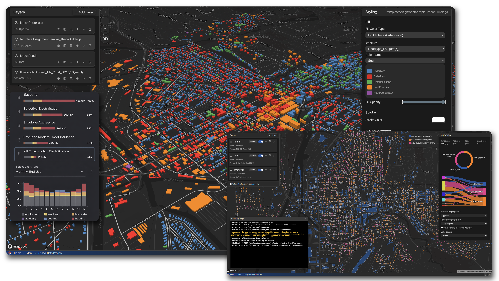

---
---

## 问题

城市尺度的能源规划需要在公用事业的体量上保留建筑级的细节。建筑模型、地理空间背景数据、实测的智能电表
（smart meter）观测数据与物理仿真必须在同一个体系中协同工作，而不是分散在彼此割裂的工具里。

## 系统与方法

EnergyAtlas.io 是基于 C#/.NET 构建的城市尺度公用事业数字孪生与能源仿真平台，其核心架构包含四个部分：

- **仿真** —— 城市尺度的建筑能耗物理仿真。
- **几何** —— 建筑模型及其所需的几何处理。
- **数据** —— 与模型集成的地理空间数据和智能电表观测数据。
- **可视化** —— 在城市范围内呈现分析结果。

可扩展的数据流程涵盖 LiDAR 处理、遮阳分析、时间序列处理与大规模城市仿真。

## 我的贡献

自 2025 年 1 月起担任首席开发者，我主导平台开发，设计了其仿真、几何、数据与可视化的核心架构，并构建了
LiDAR、遮阳分析、时间序列处理与大规模仿真等数据流程。

## 技术细节

仿真引擎、数据架构、校准流程与可扩展性的详细内容有待补充来源材料；上述各节反映的是已经过核实的项目描述。
