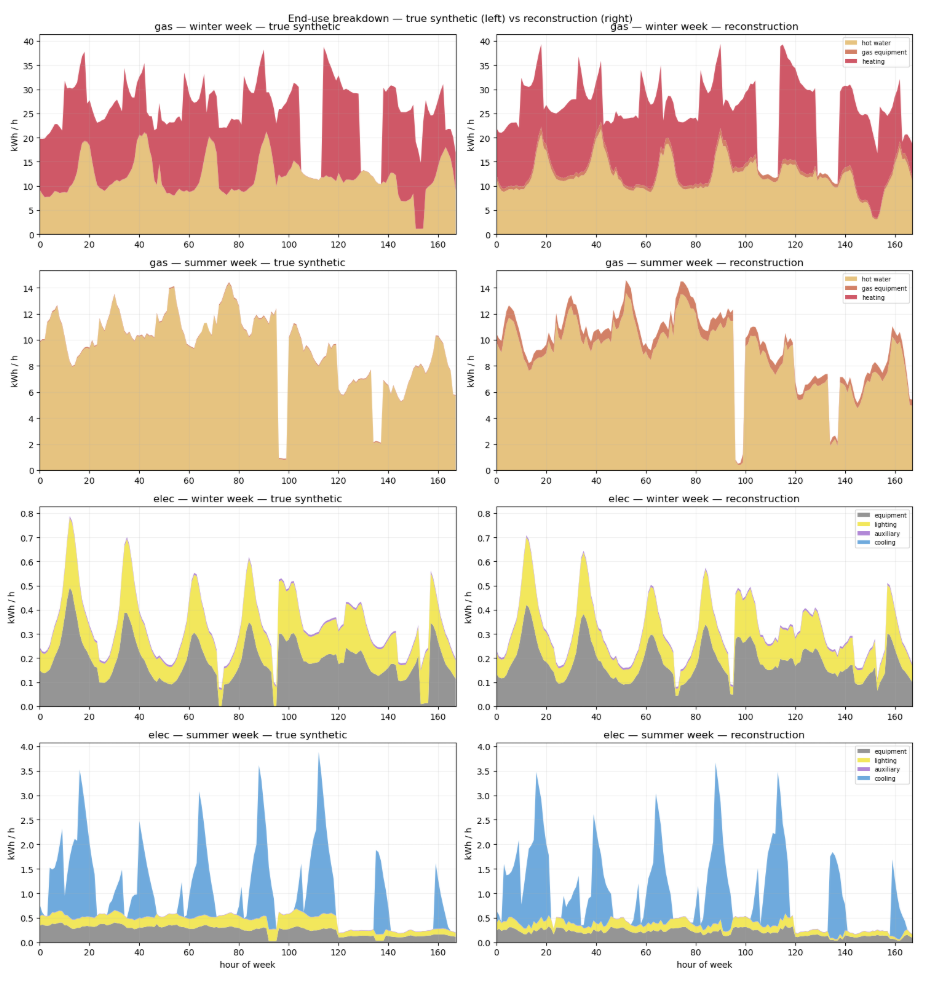

---
title:
  en: Scalable Smart-Meter Calibration of Urban Building Energy Models
  zh: 面向城市建筑能源模型的可扩展智能电表数据校准
short_title:
  en: Inverse Calibration
  zh: 逆向校准
summary:
  en: Physics-supervised inverse surrogate learning to infer building energy model parameters from hourly smart-meter data, with uncertainty-aware calibration at urban scale.
  zh: 通过物理监督的逆向代理学习，从逐小时智能电表数据中推断建筑能源模型参数，实现考虑不确定性的城市尺度模型校准。
status: active
start_date: 2024-08
end_date: null
published: true
featured: true
home_order: 2
types: [research]
topics:
  - en: Load profile inference
    zh: 负荷曲线推断
  - en: Inverse modeling
    zh: 逆向建模（inverse modeling）
  - en: Surrogate learning
    zh: 代理学习（surrogate learning）
  - en: Model calibration
    zh: 模型校准
technologies: []
hero_image: ./thumbnail.png
show_hero_on_page: false
hero_alt:
  en: Cutaway building with electricity and gas profiles feeding an inverse neural network that estimates envelope, thermal-mass, and system parameters.
  zh: 剖切建筑示意图，电力与燃气负荷曲线输入逆向神经网络，用于估计围护结构、热质量和系统参数。
affiliation:
  en: Environmental Systems Lab, Cornell University
  zh: 康奈尔大学 Environmental Systems Lab
related_project_ids: [energyatlas]
---

## Problem

Calibrating building energy models typically requires repeatedly adjusting uncertain inputs through
optimization or Bayesian inference. Repeating this process for thousands of buildings is computationally
expensive. Calibration also faces equifinality: different combinations of envelope, system, and schedule
parameters can produce similar energy-use profiles, making a unique solution difficult to identify.

## Method

This research develops a physics-supervised amortized inverse calibration framework around a reduced-order
5R1C building energy model. The approach shifts repeated calibration work into a shared training process,
learning to infer plausible parameters directly from hourly electricity and gas profiles and known boundary
conditions.

Synthetic training data are generated by sampling physical, system, and schedule parameters across weather
and building conditions. Simulator-derived zone-air and thermal-mass temperatures provide auxiliary
supervision, connecting the inferred parameters to the model’s internal thermal behavior.

## My Contribution

As part of my doctoral research at Cornell’s [Environmental Systems Lab](https://es.aap.cornell.edu/), I develop inverse-modeling and
surrogate-learning methods for calibrating building energy models from measured time series.

## Evaluation Design

Four progressively enriched models isolate the contribution of each component:

1. **Deterministic inverse baseline:** establishes parameter-recovery performance.
2. **Internal-state supervision:** tests whether auxiliary thermal-state targets improve reconstruction of
   internal temperatures.
3. **Forward-simulation consistency:** tests whether inferred parameters reproduce observed energy
   trajectories when passed through the simulator.
4. **Probabilistic inverse inference:** represents uncertainty and multiple plausible parameter combinations.

Evaluation covers parameter recovery, internal-state reconstruction, forward reconstruction, uncertainty
representation, and generalization to unseen observations.

*Synthetic end-use profiles (left) and their reconstructions (right) for winter and summer weeks.
Gas profiles separate hot water, gas equipment, and heating; electricity profiles separate equipment,
lighting, auxiliary loads, and cooling.*

## Building-Stock Application

The study applies the framework to approximately 40,000 buildings with one year of hourly electricity and
gas smart-meter data. Performance is evaluated against held-out meter observations, with conventional
iterative calibration on a representative subset providing an accuracy and computational-cost benchmark.

The central research question is whether amortized inference can make building-stock calibration
computationally practical while retaining uncertainty in non-unique solutions.
